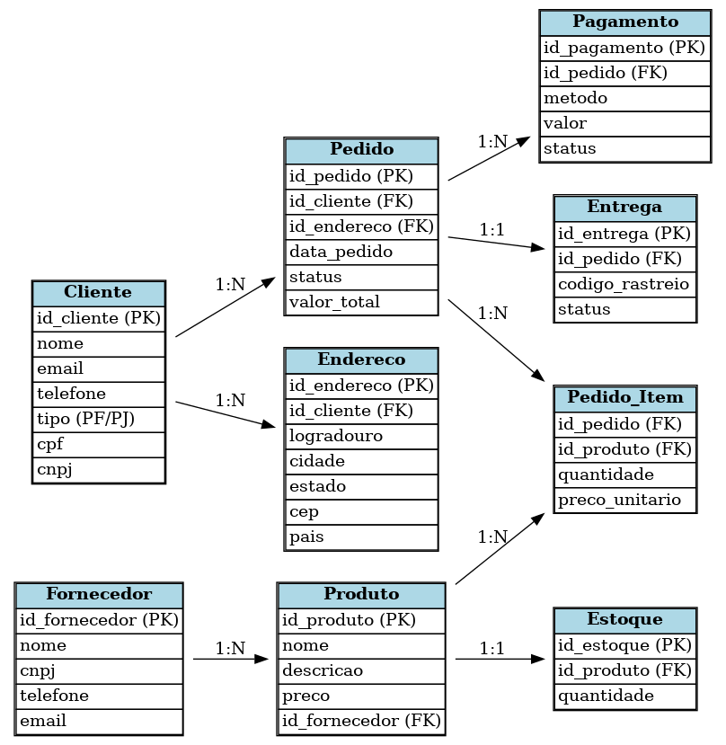

# 📦 Banco de Dados E-commerce – ERD

## 🎯 Objetivo
Modelar um banco de dados relacional para um sistema de **E-commerce**, contemplando:
- Produtos, Fornecedores e Estoque
- Clientes (Pessoa Física ou Jurídica)
- Pedidos, Itens do Pedido
- Pagamentos e Entregas

---

## 📊 Entidades Principais

### **Cliente**
- Pessoa Física (**CPF**) ou Jurídica (**CNPJ**) – nunca os dois.
- Pode ter múltiplos endereços.
- Pode realizar múltiplos pedidos.
- Relacionamentos:
  - **1:N** Endereço
  - **1:N** Pedido

---

### **Fornecedor**
- Responsável por fornecer produtos.
- Cada fornecedor pode fornecer vários produtos.
- Relacionamento:
  - **1:N** Produto

---

### **Produto**
- Pertence a um fornecedor.
- Possui estoque.
- Relacionamento:
  - **1:1** Estoque
  - **N:N** Pedido (via Pedido_Item)

---

### **Pedido**
- Criado por um cliente.
- Pode conter vários produtos.
- Pode ter várias formas de pagamento.
- Possui status e endereço de entrega.
- Relacionamentos:
  - **1:N** Pagamento
  - **1:1** Entrega
  - **N:N** Produto (via Pedido_Item)

---

### **Pagamento**
- Um pedido pode ter mais de uma forma de pagamento.
- Contém valor, método e status.

---

### **Entrega**
- Associada a um pedido.
- Possui código de rastreio e status.

---

## 🔗 Relacionamentos
- Cliente **1:N** Endereço  
- Cliente **1:N** Pedido  
- Pedido **1:N** Pagamento  
- Pedido **1:1** Entrega  
- Pedido **N:N** Produto (via Pedido_Item)  
- Produto **1:1** Estoque  
- Fornecedor **1:N** Produto  

---

## 📌 Diagrama ERD



---

## 🗂️ Estrutura SQL (DDL)
```sql
-- CLIENTE
CREATE TABLE Cliente (
    id_cliente INT PRIMARY KEY AUTO_INCREMENT,
    nome VARCHAR(150) NOT NULL,
    email VARCHAR(100) UNIQUE NOT NULL,
    telefone VARCHAR(20),
    tipo ENUM('PF', 'PJ') NOT NULL,
    cpf CHAR(11) UNIQUE,
    cnpj CHAR(14) UNIQUE,
    CONSTRAINT chk_tipo CHECK (
        (tipo = 'PF' AND cpf IS NOT NULL AND cnpj IS NULL) OR
        (tipo = 'PJ' AND cnpj IS NOT NULL AND cpf IS NULL)
    )
);

-- ENDEREÇO DO CLIENTE
CREATE TABLE Endereco (
    id_endereco INT PRIMARY KEY AUTO_INCREMENT,
    id_cliente INT,
    logradouro VARCHAR(200),
    cidade VARCHAR(100),
    estado CHAR(2),
    cep CHAR(8),
    pais VARCHAR(50),
    FOREIGN KEY (id_cliente) REFERENCES Cliente(id_cliente)
);

-- FORNECEDOR
CREATE TABLE Fornecedor (
    id_fornecedor INT PRIMARY KEY AUTO_INCREMENT,
    nome VARCHAR(150) NOT NULL,
    cnpj CHAR(14) UNIQUE NOT NULL,
    telefone VARCHAR(20),
    email VARCHAR(100)
);

-- PRODUTO
CREATE TABLE Produto (
    id_produto INT PRIMARY KEY AUTO_INCREMENT,
    nome VARCHAR(150) NOT NULL,
    descricao TEXT,
    preco DECIMAL(10,2) NOT NULL,
    id_fornecedor INT,
    FOREIGN KEY (id_fornecedor) REFERENCES Fornecedor(id_fornecedor)
);

-- ESTOQUE
CREATE TABLE Estoque (
    id_estoque INT PRIMARY KEY AUTO_INCREMENT,
    id_produto INT UNIQUE,
    quantidade INT NOT NULL,
    FOREIGN KEY (id_produto) REFERENCES Produto(id_produto)
);

-- PEDIDO
CREATE TABLE Pedido (
    id_pedido INT PRIMARY KEY AUTO_INCREMENT,
    id_cliente INT,
    id_endereco INT,
    data_pedido DATETIME DEFAULT CURRENT_TIMESTAMP,
    status ENUM('Criado','Pago','Enviado','Entregue','Cancelado') DEFAULT 'Criado',
    valor_total DECIMAL(10,2),
    FOREIGN KEY (id_cliente) REFERENCES Cliente(id_cliente),
    FOREIGN KEY (id_endereco) REFERENCES Endereco(id_endereco)
);

-- ITENS DO PEDIDO (N:N)
CREATE TABLE Pedido_Item (
    id_pedido INT,
    id_produto INT,
    quantidade INT NOT NULL,
    preco_unitario DECIMAL(10,2) NOT NULL,
    PRIMARY KEY (id_pedido, id_produto),
    FOREIGN KEY (id_pedido) REFERENCES Pedido(id_pedido),
    FOREIGN KEY (id_produto) REFERENCES Produto(id_produto)
);

-- PAGAMENTO
CREATE TABLE Pagamento (
    id_pagamento INT PRIMARY KEY AUTO_INCREMENT,
    id_pedido INT,
    metodo ENUM('CartaoCredito','Boleto','Pix','Transferencia'),
    valor DECIMAL(10,2) NOT NULL,
    status ENUM('Aguardando','Aprovado','Recusado') DEFAULT 'Aguardando',
    FOREIGN KEY (id_pedido) REFERENCES Pedido(id_pedido)
);

-- ENTREGA
CREATE TABLE Entrega (
    id_entrega INT PRIMARY KEY AUTO_INCREMENT,
    id_pedido INT UNIQUE,
    codigo_rastreio VARCHAR(50),
    status ENUM('Preparando','EmTransito','Entregue','Devolvido') DEFAULT 'Preparando',
    FOREIGN KEY (id_pedido) REFERENCES Pedido(id_pedido)
);
```
